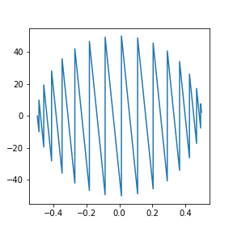
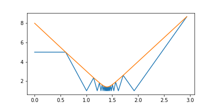

2019.12.04
================

find pi digit with elastic collision
--------------------------------------

.. note::
    this project inspired by 3Blue 1Brown

.. code-block:: python

    import numpy as np
    import matplotlib.pyplot as plt
    class count:
        def __init__(self,digit):
            self.digit=digit
            self.m1=1
            self.m2=100**(digit-1)
            self.v1=0
            self.v2=-5
            self.x1=5
            self.x2=10
            self.l1=2
            self.l2=2
            self.count=0
            self.record1=[self.v1/np.sqrt(self.m1)]
            self.record2=[self.v2/np.sqrt(self.m2)]
            self.recordx1=[self.x1]
            self.recordx2=[self.x2]
            self.times=[0]
            self.time=0
            self.findpi()

        #find pi with eventdriven collision events

        def findpi(self):
            while True:
                if self.v1 >=0 and self.v2>=0 and self.v2-self.v1>=0:
                    break
                if self.v1<0:
                    dt=-(self.x1-self.l1/2)/(self.v1)
                    self.time+=dt
                    self.times.append(self.time)
                    self.x1+=dt*self.v1
                    self.x2+=dt*self.v2
                    self.recordx1.append(self.x1)
                    self.recordx2.append(self.x2)

                    self.count+=1
                    self.v1 *=-1
                    self.record1.append(self.v1/np.sqrt(self.m1))
                    self.record2.append(self.v2/np.sqrt(self.m2))
                if self.v2-self.v1 <0 and self.v1>=0:
                    dt=(np.abs(self.x1-self.x2)-(self.l1+self.l2)/2)/np.abs(self.v1-self.v2)
                    self.time+=dt
                    self.times.append(self.time)
                    self.x1+=self.v1*dt
                    self.x2+=self.v2*dt
                    self.recordx1.append(self.x1)
                    self.recordx2.append(self.x2)
                    u1=self.v1
                    u2=self.v2
                    self.count+=1
                    self.v1=(u1*(self.m1-self.m2)+2*self.m2*u2)/(self.m1+self.m2)
                    self.v2=(u2*(self.m2-self.m1)+2*self.m1*u1)/(self.m1+self.m2)
                    self.record1.append(self.v1/np.sqrt(self.m1))
                    self.record2.append(self.v2/np.sqrt(self.m2))
        #plot the phasespce graph with v1/sqrt(m1) and v2/sqrt(m2)
        def plotphase(self,sizex=4,sizey=4):
            plt.figure(figsize=(sizex,sizey))
            plt.plot(self.record2,self.record1)

        #plot the position by time graph
        def plotpos(self,sizex=6,sizey=3,stick=False):
            if not stick:
                plt.figure(figsize=(sizex,sizey))
                plt.plot(self.times,self.recordx1)
                plt.plot(self.times,self.recordx2)
            else:
                newrecordx2=self.recordx2.copy()
                for i in range(len(self.recordx2)):
                    newrecordx2[i]-=(self.l1+self.l2)/2
                plt.figure(figsize=(sizex,sizey))
                plt.plot(self.times,self.recordx1)
                plt.plot(self.times,newrecordx2)

.. note::
    moving in phase graph

.. note::
    x positions by time graph
    
    Blueline: small box
    Orangeline: Big box

